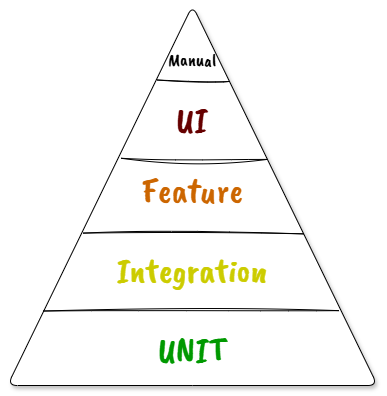

# Cycle de vie logiciel

1. Expression du besoin
2. Analyse
3. Conception
4. Développement
5. Tests
6. Mise en production
7. Maintenance

Questions
- A quels endroits parle t-on de tests ?
- A quels endroits faie les tests unitaires ?

##==##

# Pyramide de tests

Regardons à travers le prisme de la:

- Vitesse d'exécution
<!-- entre qq ms et plusieures minutes/heures/jours -->
- Fréquence des modifications
<!-- plus le test couvre une grande plage de code, plus il es succeptible de changer régulièrement -->
- Précision des résultats
<!-- un test unitaire, s'il est bien nommé, peut indiquer le problème sans même avoir à lire le code -->
- Complexité du changement

**Temps et argent ?**
