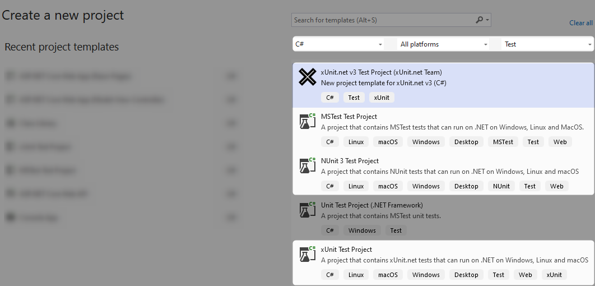

# Frameworks de tests

- MSTest
- NUnit
- xUnit
- TUnit

##==##

# Elements de comparaison

- Syntaxe : Mots clés utilisés pour les tests et pour les asserts
- Isolation et parallélisation

- Integrations aux outils MS / Extensions

<!--
Avis et retours personnels sur chacun des frameworks.

---
MSTest, directement proposé par Microsoft. Les premières versions étaient très limitées et peu performantes.
Aujourd'hui correct, il reste moins utilisé. Malgré une très bonne intégration aux outils Microsoft, il 'lag' souvent derrière les autres frameworks en terme de fonctionnalités.

Choix: Correct mais pas le meilleur. Le point fort est principalement l'intégration avec certains outils MS.

---
NUnit, ancien, directement inspiré du framework de Java.
La configuration par default peut rapidement amener à des résultats innatendus et il demande plus de connaissances et de rigueur pour avoir une suite de tests propre et efficace.

Choix : Déconséillé.

---
XUnit, est le plus utilisé et le plus simple pour les tests unitaires.
Rapide et léger. Sa philosophie le rend idéal pour les tests unitaires, mais il est moins adapté pour les tests d'intégration et fonctionnels.

Choix: le plus populaire. Parfait pour les tests unitaires, mais pas pour les tests d'intégration et fonctionnels.

---
Tunit est un tout nouveau framework. Il est tout aussi bon que xUnit, et propose en plus de très bonnes fonctionalités pour les tests d'intégration et fonctionnels, en plus de très bonnes performances.
Deux inconvénients: sa jeunesse, et le fait qu'il ne fonctionne qu'avec "Microsft Test Platform" et pas avec "VsTest".

Choix: probablement le meilleur, mais sa jeunesse le rend plus "risqué" sur le long terme.

-->